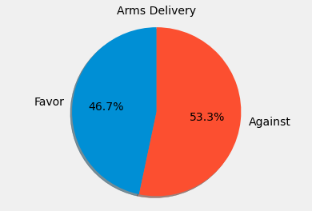
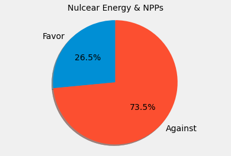
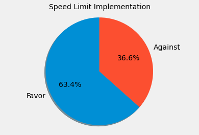

# German Twitter Stance Detection With BERT on the Russo-Ukrainian Conflict

To gain insights into the stances of Twitter users in Germany towards the Russo-Ukrainian conflict, a German BERT model was fine-tuned for cross-target stance detection and applied on 2022 Twitter data for prediction and analysis.

## General Information 
**Fine-tuned model**  
The model is available on [joh-ga/german-tweetstance-bert-uncased-russiaukrainewar](https://huggingface.co/joh-ga/german-tweetstance-bert-uncased-russiaukrainewar). It achieves an F-macro score of 0.9024 on [test-1](./data/data_labeled/test1.csv) and 0.7450 on [test-2](./data/data_labeled/test2.csv).

**Targets**  
The model was fine-tuned on four targets:
+ Arms Delivery (AD): Delivery of (heavy) arms to Ukraine
+ NPPs Operation Continuation (NOC): Repeal of the planned nuclear phase-out by the end of 2022 and the continuation of NPP operations in Germany
+ Speed Limit Implementation (SLI): Implementation of a temporary speed limit on German highways
+ Ukraine Support (US): General support of Ukraine in the ongoing Russian-Ukrainian conflict 2022

**Data**  
+ [Fine-tuning](https://github.com/joh-ga/german-tweetstance-russiaukrainewar/tree/main/data/data_labeled): Tweets were auto-labeled using stance-exposing hashtags.
+ [Evaluation](https://github.com/joh-ga/german-tweetstance-russiaukrainewar/tree/main/data/data_labeled): test1 (auto-labeled), test2 (manual-labeled).
+ [Analysis](https://github.com/joh-ga/german-tweetstance-russiaukrainewar/tree/main/data/data_unlabeled): Unlabeled 2022 Twitter data (02/24/2022 until 12/31/2022).

The complete dataset is made available for the research community. Due to privacy restrictions of the Twitter API, only the text IDs, the target as keywords as well as in the form of a German question, and stance labels (against, favor) are provided. The complete data can be retrieved via the Twitter API with appropriate access. Note: For underrepresented classes a [back translation](https://github.com/joh-ga/german-tweetstance-russiaukrainewar/blob/main/src/backtranslation.py) was performed that is not included in the dataset files.  

Class Distribution of Auto-[Labeled Dataset](./data/data_labeled)
| :---: |
||

**Preprocessing**  
The model receives as input the target formulated as a question along with the corresponding tweet: target question [SEP] tweet. 
Information on the text preprocessing can be found [here](https://github.com/joh-ga/german-tweetstance-russiaukrainewar/blob/main/src/preprocessing.py).

![CC BY 4.0][cc-by-shield]

[cc-by-shield]: https://img.shields.io/badge/License-CC%20BY%204.0-lightgrey.svg

## Exploratory Analysis 2022 Twitter Data
### Stance Prediction Results
|| |
| :---: | :---: |
|| |

### Tweet Volume Timelines
Ukraine Support | Arms Delivery |
| :---: | :---: |
|| |
|Nuclear Energy & NPPs | Speed Limit Implementation|
|||

### Takeaways
The classified data provide clues to potential arguments and reasons of a stance-group identified with word frequencies and keyword-in-context consideration.

**Target Ukraine Support**  
German-speaking Twitter users have been debating Germany's political course in the conflict. Users who are in favor or against towards the general support of Ukraine in the conflict often use the same arguments as of the following socio-political related topics that have been discussed and found in 2022 Twitter data. Throughout 2022, it can be seen that the number of users who have a favorable stance towards supporting Ukraine in the conflict outweighs the number of users with an opposing stance (tweet volume timeline).

Favor-Arms Delivery | Against-Arms Delivery |
| :--- | :--- |
| The delivery of weapons to Ukraine does not make Germany a participant in the war. | The delivery of weapons to Ukraine means the active participation of Germany in the war against Russia. | 
| Military support measures can ensure a faster process of peacekeeping. | Arms deliveries prolong the war. Peace negotiations and diplomacy should begin. | 
| Ukraine needs more heavy weapons. | Ukraine is a corrupt country that does not represent German values. |
| | The German Armed Forces have no heavy weapons to supply at all.| 

Favor-Nuclear Energy | Against-Nuclear Energy |
| :--- | :--- |
| Germany needs nuclear energy for a secure future. |There is no reason to extend the operation time of NPPs, as the energy supply in Germany is secure.|
|Renewable energies are not (yet) safe enough to exclude nuclear energy as an alternative energy source.| NPPs bring with them further problems, such as with regard to the disposal of nuclear waste. |
| LNG terminals are also not sustainable.| Nuclear power is not an environment-friendly technology. |
||Nuclear energy is a source of danger. |

Favor-Speed Limit | Against-Speed Limit |
| :--- | :--- |
| A speed limit significantly reduces the emission of pollutants and is thus an important contribution to climate protection.| A speed limit does not significantly reduce pollutant emissions. |
| A speed limit increases safety on the road. |A speed limit does not increase road safety. |
| A speed limit reduces the noise level caused by motor vehicles. | A speed limit is a restriction on personal freedom. | 
| A speed limit reduces fuel consumption and thus supports Ukraine against Russia. | | 
