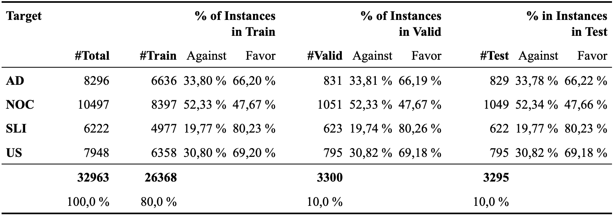
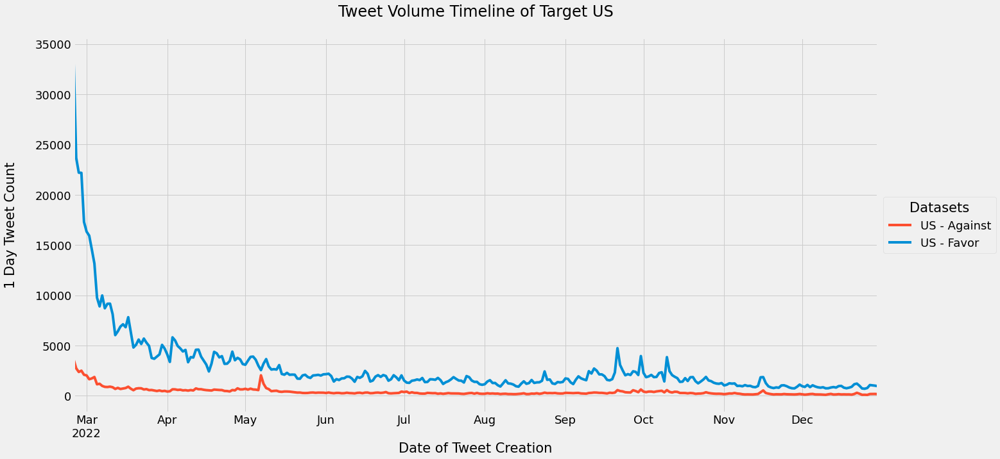
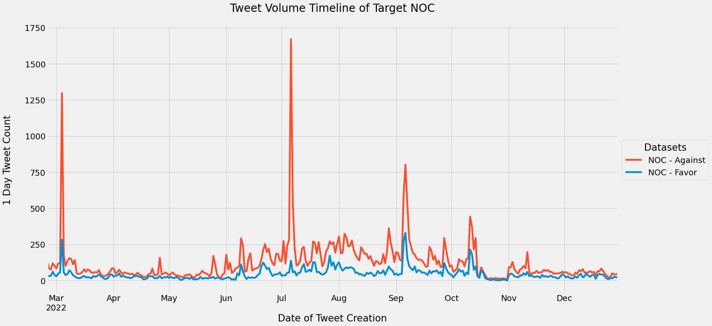
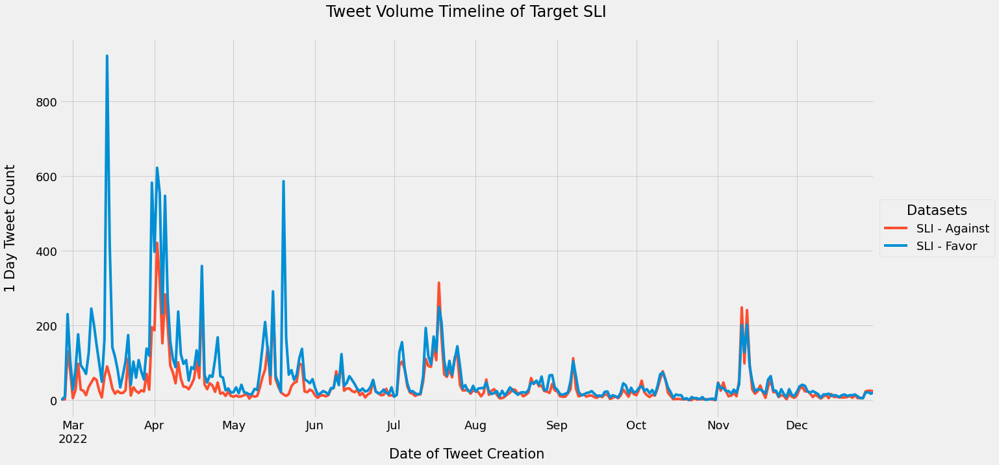

# German Twitter Stance Detection With BERT on the Russo-Ukrainian Conflict

To gain insights into the stances of Twitter users in Germany towards the Russo-Ukrainian conflict, a German BERT model was fine-tuned for cross-target stance detection and applied on 2022 Twitter data for prediction and analysis.

## General Information 
**Fine-tuned model**  
The model is available on [joh-ga/german-tweetstance-bert-uncased-russiaukrainewar](https://huggingface.co/joh-ga/german-tweetstance-bert-uncased-russiaukrainewar). It achieves an F-macro score of 0.9024 on [test-1](./data/data_labeled/test1.csv) and 0.7450 on [test-2](./data/data_labeled/test2.csv).

**Targets**  
The model was fine-tuned on four targets:
+ Arms Delivery (AD): Delivery of (heavy) arms to Ukraine
+ NPPs Operation Continuation (NOC): Repeal of the planned nuclear phase-out by the end of 2022 and the continuation of NPP operations in Germany
+ Speed Limit Implementation (SLI): Implementation of a temporary speed limit on German highways
+ Ukraine Support (US): General support of Ukraine in the ongoing Russian-Ukrainian conflict 2022

**Data**  
+ [Fine-tuning](https://github.com/joh-ga/german-tweetstance-russiaukrainewar/tree/main/data/data_labeled): Tweets were auto-labeled using stance-exposing hashtags.
+ [Evaluation](https://github.com/joh-ga/german-tweetstance-russiaukrainewar/tree/main/data/data_labeled): test1 (auto-labeled), test2 (manual-labeled).
+ [Analysis](https://github.com/joh-ga/german-tweetstance-russiaukrainewar/tree/main/data/data_unlabeled): Unlabeled 2022 Twitter data (02/24/2022 until 12/31/2022).

Due to privacy restrictions of the Twitter API, only the text IDs, the target as keywords as well as in the form of a German question, and stance labels are provided. The complete data can be retrieved via the Twitter API with appropriate access. Note: For underrepresented classes a [back translation](https://github.com/joh-ga/german-tweetstance-russiaukrainewar/blob/main/src/backtranslation.py) was performed that is not included in the dataset files.  

Class Distribution of Auto-[Labeled Dataset](./data/data_labeled)  

**Preprocessing**  
The model receives as input the target formulated as a question along with the corresponding tweet: target question [SEP] tweet. 
Information on the text preprocessing can be found [here](https://github.com/joh-ga/german-tweetstance-russiaukrainewar/blob/main/src/preprocessing.py).

![CC BY 4.0][cc-by-shield]

[cc-by-shield]: https://img.shields.io/badge/License-CC%20BY%204.0-lightgrey.svg

## Exploratory Analysis 2022 Twitter Data
### Stance Prediction Results
### Tweet Volume Timelines
Ukraine Support | Arms Delivery 
| :---: | :---: 
| 
Nuclear Energy | Speed Limit
|

### Takeaways
